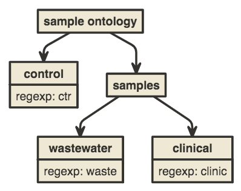

# sample_sorter

Program to sort sample names according to an ontology, with regexpes. Default usage takes a as inputs: a .tsv list of sample names, a .yaml describing the ontology and associated regular expressions.


## Usage

Use option `-h` / `--help` to see available command-line options:

```console
dr-david@cbg:~$ python ./sample_sorter.py -h
usage: sample_sorter.py [-h] -s TSV) (-y YML [-l TXT] [-t TSV] [-d] [-f] [-v]

Sort sample names into ontologies.

optional arguments:
  -h, --help            show this help message and exit
  -s TSV, --samples TSV
                        V-pipe samples list tsv
  -y YML, --onto YML    Yaml file of ontologies.
  -l TXT, --list TXT    Output results to as a txt file where each line
                        contains a list of the samples ontologies.
  -t TSV, --tsv TSV     Output results to as a tsv file where columns are
                        partial ontologies and lines are samples.
  -d, --dump            Dump the ontology list to the terminal
  -f, --force           Do not check for conflict between ontologies.
  -v, --verbose         Write what's happening in the terminal.
```

## Examples

We will use dummy data in the directory `./dummydata` to illustrate usage. We have a dummy sample list in `./dummydata/dummy.tsv`, that we want to sort according to the ontology in `./dummydata/dummy2.yaml`:
```console
dr-david@cbg:~$ cat ./dummydata/dummy.tsv
ctrl1	batch1
ctrl2	batch1
waste1	batch1
waste2	batch1
clinic1	batch1
clinic2	batch1

dr-david@cbg:~$ cat ./dummydata/dummy2.yaml
control: ctr
sample:
  clinical: clinic
  wastewater: waste
```
The ontology represented by `./dummydata/dummy2.yaml` can be visualized this way:

I.e. we have a tree where the leaves contain a regular expression and each path from root to leaf represent a possible sample ontology.

To sort the data according to the ontology and dump the list of samples ontologies to the terminal, we do:
```console
dr-david@cbg:~$ python ./sample_sorter.py -s ./dummydata/dummy.tsv -y ./dummydata/dummy2.yaml -d
('control',)
('control',)
('sample', 'wastewater')
('sample', 'wastewater')
('sample', 'clinical')
('sample', 'clinical')
```

We can also specify that we dont want this result printed to the teminal but outputted in a text file:

```console
dr-david@cbg:~$ python ./sample_sorter.py -s ./dummydata/dummy.tsv -y ./dummydata/dummy2.yaml -l ontologies_list.txt

dr-david@cbg:~$ cat ontologies_list.txt
('control',)
('control',)
('sample', 'wastewater')
('sample', 'wastewater')
('sample', 'clinical')
('sample', 'clinical')
```
Or we can also write the output as a table in a .tsv, where each column is a partial ontology:

```console
dr-david@cbg:~$ python ./sample_sorter.py -s ./dummydata/dummy.tsv -y ./dummydata/dummy2.yaml -t ontologies_table.tsv

dr-david@cbg:~$ cat ontologies_table.tsv
control	sample	wastewater	clinical
1	0	0	0
1	0	0	0
0	1	1	0
0	1	1	0
0	1	0	1
0	1	0	1
```
